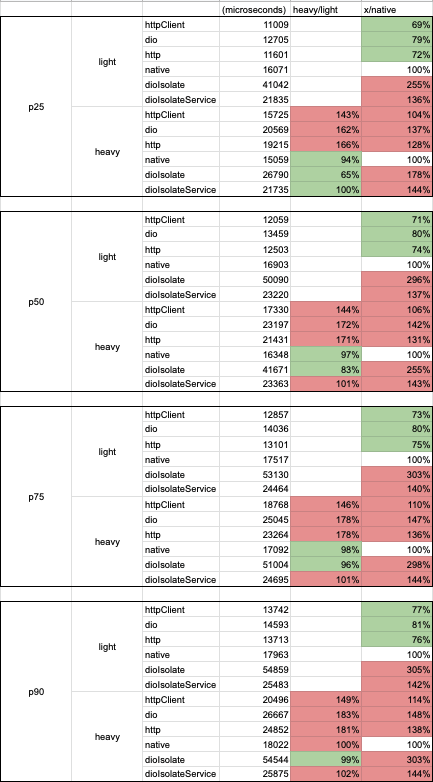

# Flutter HTTP client performance test

This test analyzes the performance impact of the load in Dart's thread over the requests from different HTTP clients.

## Environment
### Dependencies
* Flutter 3.0.2
* Dart 2.17.3
* dio 4.0.6
* http 0.13.5
* okhttp 2.5.0

### Device
* Samsung Galaxy S22
* Android 13

### HTTP Server
* [Simple HTTP Server](https://play.google.com/store/apps/details?id=com.phlox.simpleserver)
  * Hosted by the device itself to avoid network latency impact
  * Using default settings

## The HTTP clients used in the test

### [HttpClient](https://api.dart.dev/stable/2.17.3/dart-io/HttpClient-class.html) (Flutter)

The HTTP client from dart:io lib.

**Important note:** all other Flutter HTTP clients listed in this document depend on this one.

### [dio](https://pub.dev/packages/dio) (Flutter)

A powerful Http client for Dart, which supports Interceptors, Global configuration, FormData, Request Cancellation, File
downloading, Timeout etc.

### [http](https://pub.dev/packages/http) (Flutter)

A composable, Future-based library for making HTTP requests.

This package contains a set of high-level functions and classes that make it easy to consume HTTP resources. It's
multi-platform, and supports mobile, desktop, and the browser.

### native with platform channel (Android)

A solution made just for this performance test. It uses a platform channel that uses [okhttp](https://square.github.io/okhttp/) to send requests.
Each request uses a single thread from the [ExecutorService](https://developer.android.com/reference/java/util/concurrent/ExecutorService). (Android doesn't allow to make HTTP request in the main thread).

## Test scenarios

### Light scenario

A button from a Flutter screen is pressed to start **1000 HTTP requests** that are sent one at a time.

A time of **500 milliseconds** is awaited before each request start. The idea of the delay is to simulate casual requests.

The time for the HTTP request is measured in microseconds and stored in an array.

### Heavy scenario

Same as **Light scenario**, but while the execution happens, a Timer increments a counter in the screen after each **200 milliseconds**.
The counter increment behavior simulates things happening on Flutter while the requests are being made.

## Results

## Conclusions

* All the Flutter's HTTP clients perform better than the native's one on the light scenario.
* The native has the best performance on the heavy scenario.
* Considering just Flutter HTTP clients, the best to the worst performance order is: **HttpClient** -> **http** -> **dio**. That can be correlated to the amount of features these libs have.
* We can assume the native performs better on the heavy scenario because it has one extra thread to process the HTTP requests.

## Additional thoughts

Despite **dio** has the worst performance compared to the other Flutter's clients, it adds lots of features and improves the development experience.
Using a simpler HTTP client but adding similar features would make them perform closer to **dio**. 

The **native** solution could look a good way to go, but on this case, it is necessary to implement and maintain additional logic on native's side. 
